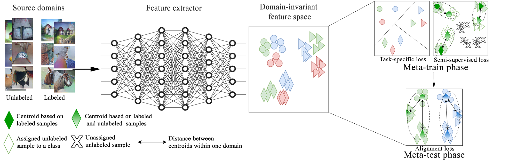

Domain Generalization via Semi-supervised Meta Learning
===================
DGSML is the first method of semi-supervised meta learning that employs two novel loss functions to learn a predictive domain-invariant representation by taking both labeled and unlabeled samples from different input domains. 



# Table of contents
1. [Installation](#installation)
2. [Test Run](#test-run)
3. [Experiments](#experiments)
4. [Output Files](#output-files)
5. [Results](#results)
6. [References](#references)

# Installation

## Requirements
- Python 3
- Conda

To get the source files of DGSML you need to clone into its repository:
```
git clone https://github.com/dgsml/DomainGeneralization.git
```

### Conda environment
All the required packages to run DGSML are specified in `environment` subdirectory of `dgsml-gpu` and `dgsml-resnet-cpu` separately.
To install these packages run the following command:
```
conda env create -f ENVIRONMENT.yml
```
Where `ENVIRONMENT.yml` is the name of the requirement file in the environment directory.
So to create the environment required for DGSML-GPU run:
```
conda env create -f dgsml-gpu/environment/dgsml_gpu.yml
```
This will create a conda environment called `dgsml_gpu`.

And to create the environment required for DGSML-CPU (resnet only) run:
```
conda env create -f dgsml-resnet-cpu/environment/dgsml_cpu.yml
```
This will create a conda environment called `dgsml_cpu`.

After the successful installation of the packages into environmet you would be able to load them using `conda activate`.

### Dataset
We used PACS and VLCS benchmarks to evaluate the performance of DGSML and the studied baselines. 
PACS was obtained from [here](http://www.eecs.qmul.ac.uk/~dl307/project_iccv2017) and VLCS from [here](https://github.com/fmcarlucci/JigenDG).
Before running DGSML, unzip the data using following commands:
```
cd data/DATASET_NAME/
for F in *.tar.gz; do tar -xzvf ${F}; done
```
Where `DATASET_NAME` is either PACS or VLCS.

# Test Run
To run a small test:
```
cd dgsml-gpu/scripts/
bash test_run.bs
```
It can also be submitted to a cluster.

# Experiments
This section provides instructions to reproduce the reported experimnets using AlexNet and ResNet-18.
It is important to note that AlexNet experiments are designed to be performed on GPU only and ResNet-18 experiments on CPU only.

## AlexNet 
The scripts for submitting VLCS and PACS jobs using AlexNet to a cluster are provided in `dgsml-gpu/scripts/` directory.
GPU resources should be added to the header section of the batch scripts based on the GPU settings on your system before submitting them to the cluster.
On a slurm job scheduling system they can be submitted to a cluster using:
```
cd dgsml-gpu/scripts/

mkdir -p output_vlcs
mkdir -p log_vlcs
sbatch test_VLCS.bs

mkdir -p output_pacs
mkdir -p log_pacs
sbatch test_PACS.bs
```

## ResNet-18
The scripts for submitting PACS jobs using ResNet-18 to a cluster are provided in `dgsml-gpu/scripts/` directory.
On a slurm job scheduling system they can be submitted to a cluster using:
```
cd dgsml-resnet-cpu/scripts/

mkdir -p output_pacs
mkdir -p log_pacs
sbatch test_PACS.bs
```

# Output Files
The structure of an output directory (e.g. `save0.95_1_photo`) after a successful run will be as follows:
In this example 0.95 is the rate of unlabeled samples, 1 is the run id (a number between 1 to 5 corresponding to an independent run with a specific seed value), and photo is the target domain.

```
save0.95_1_photo
├── args.txt            # Input arguments passed to DGSML and training losses
├── Best_CLS.pt         # Best saved classifier
├── Best_FT.pt          # Best saved feature extractor
├── Best_val.txt        # Saved validation accuracies
└── Target.txt          # Target accuracy
```

# Results
To obtain a table of the accuracy results you can run `show_vlcs_result.sh` for AlexNet and `show_pacs_result.sh` for both AlexNet and ResNet-18.
These scripts are provided in `dgsml-gpu/scripts/` and `dgsml-resnet-cpu/scripts/`.

For AlexNet results run:
```
cd dgsml-gpu/scripts/
bash show_vlcs_result.sh
bash show_pacs_result.sh 
```

For ResNet-18 results run:
```
cd dgsml-resnet-cpu/scripts/
bash show_pacs_result.sh
```
Note that for each rate of unlabeled samples and each target domain, 5 independent runs with different seed values are added to the job list which their accuracies appear in the tables generated by the bash scripts mentioned above.

# References
In the implementation of DGSML, we reused some codes from the following repositories.
- [HAHA-DL/MLDG](https://github.com/HAHA-DL/MLDG)
- [liyiying/Feature_Critic](https://github.com/liyiying/Feature_Critic)
- [mil-tokyo/dg_mmld](https://github.com/mil-tokyo/dg_mmld)
- [rshaojimmy/AAAI2020-RFMetaFAS](https://github.com/rshaojimmy/AAAI2020-RFMetaFAS)
 
